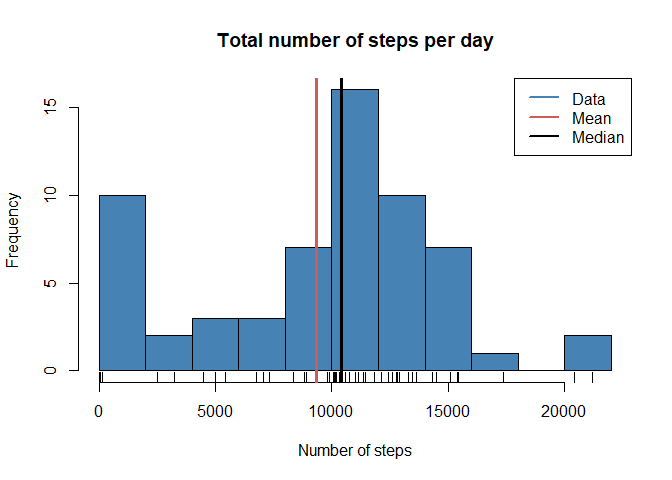
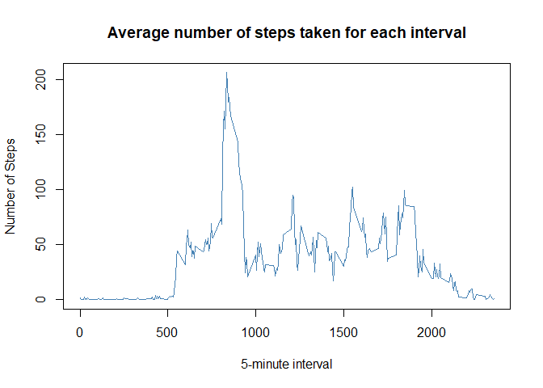
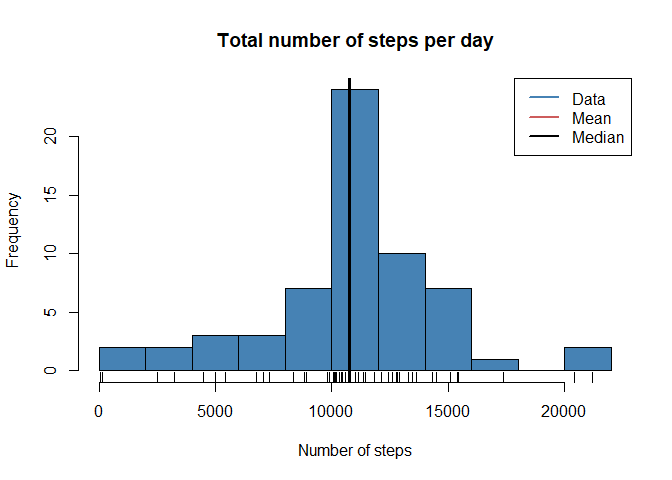
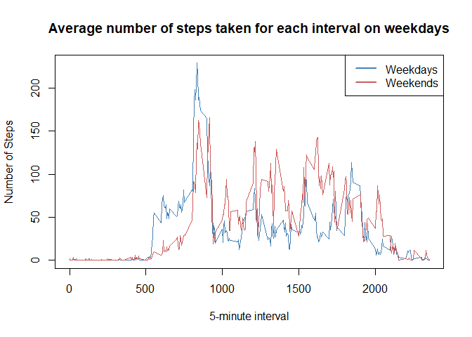

Quantifies self-movement: An statistical study
================
Juan Luis Jurado
2023-11-26

``` r
library(ggplot2)
```

    ## Warning: package 'ggplot2' was built under R version 4.3.2

``` r
library(plyr)
```

## Loading and preprocessing data

We will first load the data into R with the read.csv() function.
Additionally, transforming the *date* column into “Date” class will help
us during the analysis.

``` r
activity = read.csv("activity.csv")
activity$date = as.Date(activity$date)
```

## What is mean total number of steps taken per day?

First, we compute the total number of steps per day, the mean and the
median value (ignoring missing numbers). We do this using the date
column as a factor.

``` r
dailySteps = tapply(activity$steps, factor(activity$date), sum, na.rm = TRUE)
avg = mean(dailySteps, na.rm = TRUE)
mdn = median(dailySteps, na.rm = TRUE) 
```

We obtain that the mean value for the number of steps taken in one day
is approximately 9354, while the median is 10395. Then, we can plot the
histogram of the total number of steps, showing where the mean and
median lie.

``` r
hist(dailySteps, breaks = 10, main = "Total number of steps per day", xlab = "Number of steps", col = "steelblue")
rug(dailySteps)

abline(v = avg, col = "indianred", lw = 3)
abline(v = mdn, col = "black", lw = 3)

legend("topright", legend = c("Data", "Mean", "Median"), 
       lty = c(1, 1, 1), lwd = c(2, 2, 2), 
       col = c("steelblue", "indianred", "black"))
```

<!-- -->

## What is the average daily activity pattern?

For this question, we first need to obtain the average number of steps
taken for each of the different intervals across all days. Then, we just
need to plot the interval of the day and the average number of steps
taken.

``` r
stepsInterval = aggregate(steps ~ interval, activity, mean, na.rm = TRUE)

plot(stepsInterval$interval, stepsInterval$steps, type="l",
     main="Average number of steps taken for each interval",
     ylab="Number of Steps", xlab="5-minute interval", col="steelblue")
```

<!-- -->

We now are asked to find the interval containing the highest number of
steps (on average).

``` r
maxInt = which.max(stepsInterval$steps)
```

Thus, the interval with the highest number of steps on average is
interval 835, with 206 steps.

## Imputing missing values

Up until now, we have ignored the missing values on the dataset.
However, we now need to impute this values to create a full tidy
dataset. To do this, we will make use of the fact that we have already
computed the mean value for each 5-minute interval of the day.
Therefore, we will substitute each missing value with the average for
its corresponding interval.

``` r
nMV = sum(is.na(activity$steps))

N = length(activity$steps)
n = length(stepsInterval$steps)
for (i in seq_len(N)){
        if (is.na(activity$steps[i])){
                activity$steps[i] = stepsInterval$steps[i%%n + 1]
        }
}

nMV2 = sum(is.na(activity$steps))
```

We have first checked the number of missing values on the data, which
returns 2304. We then used a loop to iterate and replace every missing
value according to the devised strategy, and finally check that after
the imputation the total number of MV is 0. Thus, the MV have been
correctly imputed.

Now that the data set is complete, we will redo the analysis performed
in the first section, to see how MV affected this result.

``` r
dailySteps2 = tapply(activity$steps, factor(activity$date), sum)
avg2 = mean(dailySteps2)
mdn2 = median(dailySteps2) 
```

We can compare the previous values of the mean and median (9354, 10395)
with the new ones (1.0766^{4}, 1.0766189^{4}) to see that both have
increased. In fact, now the mean and median coincide.

``` r
hist(dailySteps2, breaks = 10, main = "Total number of steps per day", xlab = "Number of steps", col = "steelblue")
rug(dailySteps2)

abline(v = avg2, col = "indianred", lw = 3)
abline(v = mdn2, col = "black", lw = 3)

legend("topright", legend = c("Data", "Mean", "Median"), 
       lty = c(1, 1, 1), lwd = c(2, 2, 2), 
       col = c("steelblue", "indianred", "black"))
```

<!-- -->

From the histogram, we can now see that both metrics coincide and lie
over the 10000 steps mark. In addition, the overall frequency of the
bins is higher (specially near the center).

## Are there differences in activity patterns between weekdays and weekends?

First, we have written a function which takes a date as an input and
outputs either “weekend” or “weekday” depending on the day of the week
of the given date.

``` r
day_class = function(date){
        
        if (weekdays(date) %in% c("Saturday","Sunday")){
                return("weekend")
        }
        else {
                return("weekday")
        }
}
```

Note that this function only works for certain languages in R. Thus, in
order to guarantee the integrity of the results we must set the language
to English.

``` r
Sys.setlocale("LC_TIME", "English_United States.1252")
```

    ## [1] "English_United States.1252"

Now we can add a factor column to our dataset which classifies the
different dates into weekdays or weekends.

``` r
day = lapply(activity$date, FUN = day_class)
activity$day = factor(unlist(day))
```

Finally, we need to repeat the time series plot we made previously but
using the complete dataset and making a distinction between weekdays and
weekends. To do this, we subset our data into two different dataframes.

``` r
activityWD = subset(activity, day == "weekday")
activityWE = subset(activity, day == "weekend")

stepsIntervalWD = aggregate(steps ~ interval, activityWD, mean)
stepsIntervalWE = aggregate(steps ~ interval, activityWE, mean)

plot(stepsIntervalWD$interval, stepsIntervalWD$steps, type="l",
     main="Average number of steps taken for each interval on weekdays",
     ylab="Number of Steps", xlab="5-minute interval", col="steelblue")
lines(stepsIntervalWE$interval, stepsIntervalWE$steps, type="l",
     main="Average number of steps taken for each interval on weekends",
     ylab="Number of Steps", xlab="5-minute interval", col="indianred")
legend("topright", legend = c("Weekdays", "Weekends"), 
       lty = c(1, 1), lwd = c(2, 2), 
       col = c("steelblue", "indianred"))
```

<!-- -->

We can see from the plot that weekends tend to have higher number of
steps in general, except on the peak corresponding to intervals 700-900,
where the steps taken on weekdays exceeds that of weekends.
